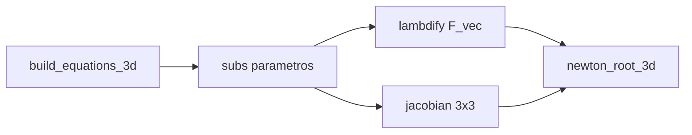

# Guía ilustrativa: equilibrios 3D con SymPy y Newton–Raphson

Enfoque **exclusivamente 3D** ($(c,s,i)$ y `build_equations_3d` / `newton_root_3d`), alineado con el PDF `proceso_estados_estacionarios.pdf`. La reducción 2D y las tablas de escenarios siguen en [`steady_states_resumen.md`](steady_states_resumen.md).

Documentación alineada con el código en `Models/Allee/steady_states/steady_states.py` y con el PDF generado a partir de:

- **Fuente LaTeX:** [`Models/Allee/steady_states/proceso_estados_estacionarios.tex`](../../../Models/Allee/steady_states/proceso_estados_estacionarios.tex)
- **PDF compilado:** `Models/Allee/steady_states/proceso_estados_estacionarios.pdf` (misma carpeta que el `.tex`)

Las **cifras del ejemplo numérico** deben coincidir con las del PDF; para reproducirlas use el comando indicado más abajo o `build_numeric_3d` + un paso de Newton en Python.

> **Relación con** [`steady_states_resumen.md`](steady_states_resumen.md): ese archivo centra la discusión en la **reducción 2D** (cuasi-estática de \(i\)), tablas de escenarios e interpretación. **Aquí** se detalla el **sistema 3D completo** y el uso de **Jacobiano simbólico + `lambdify` + `newton_root_3d`**, como en `extract_steady_states_from_scenarios.py`.

## Diagrama del pipeline



## 1. Problema en \(\mathbb{R}^3\)

Vector de estado \(\mathbf{x}=(c,s,i)^\top\) y campo \(\mathbf{F}:\mathbb{R}^3\to\mathbb{R}^3\),

\[
\mathbf{F}(\mathbf{x}) = \begin{pmatrix} F_c(c,s,i) \\ F_s(c,s,i) \\ F_i(c,s,i) \end{pmatrix}.
\]

Se busca \(\mathbf{F}(\mathbf{x}^\ast)=\mathbf{0}\) (equilibrio del subsistema de reacción \(\dot{\mathbf{x}}=\mathbf{F}(\mathbf{x})\)).

## 2. Construcción simbólica (`build_equations_3d`)

- **Allee débil:** \(\mathrm{alle}_{\mathrm{weak}}(c)= r_c\,c\,(c-a)\,(1-c)\).
- **Allee fuerte:** \(\mathrm{alle}_{\mathrm{strong}}(c)= r_c\,c\,(1-c)\,\frac{c-a}{1-a}\).

Componentes (sin fuentes externas salvo control):

\[
\begin{aligned}
F_c &= \mathrm{alle}(c) - c(\alpha s^2 + \beta i^2) - \mu c(\gamma s^2 + \eta i^2), \\
F_s &= r_s s(1-s) - \gamma c^2 s + \delta i^2 s - \tfrac{\mu\alpha}{2} c^2 s, \\
F_i &= r_d i(1-i) + \delta i s^2 - \eta c^2 i - \tfrac{\mu\beta}{2} c^2 i + u_{\mathrm{ctrl}}.
\end{aligned}
\]

Con **control Hill** (`include_hill_control=True`): \(i_+=\max(i,0)\),

\[
H_{\mathrm{act}}(c)=\frac{c^{n_c}}{k_c^{n_c}+c^{n_c}},\quad
H_{\mathrm{inh}}(i)=\frac{k_i^{n_i}}{k_i^{n_i}+i_+^{n_i}},\quad
u_{\mathrm{ctrl}} = u_{\max}\,H_{\mathrm{act}}(c)\,H_{\mathrm{inh}}(i).
\]

Sin Hill: \(u_{\mathrm{ctrl}}=0\).

## 3. Jacobiano analítico

\[
J(c,s,i) = \frac{\partial \mathbf{F}}{\partial(c,s,i)} \in \mathbb{R}^{3\times 3}.
\]

En \(\mathbf{x}^\ast\), \(J(\mathbf{x}^\ast)\) gobierna la linealización ODE y los autovalores dan estabilidad local.

## 4. Puente SymPy → NumPy (`build_numeric_3d`)

1. Sustituir parámetros numéricos en \(F_c,F_s,F_i\) (`.subs`).
2. `F_vec = Matrix([Fc, Fs, Fi])`, `J = F_vec.jacobian([c, s, i])`.
3. `f = lambdify((c, s, i), F_vec, modules='numpy')` → evaluación rápida de \(\mathbf{F}\).
4. En cada iteración de Newton: **no** se diferencia por diferencias finitas; se hace `J.subs({c: x, s: y, i: z})` y se convierte a `numpy.ndarray` float.

`extract_steady_states_from_scenarios.py` replica esta cadena tras elegir la rama Hill / mínimo / sin control.

## 5. Algoritmo `newton_root_3d`

Para \(k=0,1,\ldots\):

1. \(\mathbf{F}^k = \mathbf{f}(c^k,s^k,i^k)\).
2. \(J_{\mathrm{num}}^k = J\) evaluado en \((c^k,s^k,i^k)\).
3. Si hay no-finitos o \(\mathrm{cond}(J_{\mathrm{num}}^k) > \kappa_{\max}\), abortar.
4. Resolver \(J_{\mathrm{num}}^k \boldsymbol{\delta}^k = \mathbf{F}^k\).
5. \(\mathbf{x}^{k+1} = \mathbf{x}^k - \boldsymbol{\delta}^k\).
6. Parar si \(\|\boldsymbol{\delta}^k\| < \varepsilon\) (por defecto \(\varepsilon=10^{-8}\), \(N_{\max}=80\), \(\kappa_{\max}=10^{12}\)).

## 6. Multirraíz y semillas

Varias raíces; Newton es local. El código usa rejillas de semillas, puntos extra cerca de \(c\approx 0\), \(s\approx 1\), \(i\approx 1\), y deduplicación por distancia.

## 7. Ejemplo numérico reproducible

**Configuración:** WEAK, sin Hill, \(\mu=1\), resto `params_base_3d` del repo (\(r_c=5{,}84\), \(r_s=13{,}12\), \(r_d=10{,}92\), \(\alpha=10{,}22\), \(\delta=5{,}40\), \(\beta=7{,}6\), \(a=0{,}1\), \(\gamma=0{,}74\), \(\eta=5{,}08\)).

Desde el directorio `Allee`:

```bash
python steady_states/verify_equilibrium_point.py --allee WEAK --no-hill --newton-seed 0.2 0.2 0.2
```

**Primera iteración** desde \(\mathbf{x}^0=(0{,}2,\,0{,}2,\,0{,}2)^\top\):

\[
\mathbf{F}(\mathbf{x}^0)\approx \begin{pmatrix} -0{,}09568 \\ 2{,}09560 \\ 1{,}71936 \end{pmatrix},\quad
J(\mathbf{x}^0)\approx \begin{pmatrix}
 0{,}3392 & -0{,}8768 & -1{,}0144 \\
-0{,}4680 &  7{,}8540 &  0{,}4320 \\
-0{,}7104 &  0{,}4320 &  6{,}4128
\end{pmatrix}.
\]

\(J(\mathbf{x}^0)\boldsymbol{\delta}^0=\mathbf{F}(\mathbf{x}^0)\) da \(\boldsymbol{\delta}^0\approx(2{,}07638,\,0{,}36450,\,0{,}47358)^\top\) y

\[
\mathbf{x}^1=\mathbf{x}^0-\boldsymbol{\delta}^0\approx (-1{,}87638,\,-0{,}16450,\,-0{,}27358)^\top
\]

(un paso puede salir del ortante \(c,s,i\ge 0\): método local).

**Iteración completa:** con la misma semilla, el código converge a un punto cercano a \((0,0,0)\) con \(\|\mathbf{F}\|\sim 10^{-25}\). Otras semillas llevan a otras raíces (p. ej. \(c\approx 1\), \(s\approx 0\), \(i\approx 0\)).

**Reproducción en código:**

```python
from steady_states.steady_states import build_numeric_3d, newton_root_3d, mu

f, Jsym, _ = build_numeric_3d({mu: 1.0}, allee_type="WEAK", include_hill_control=False)
root = newton_root_3d(f, Jsym, (0.2, 0.2, 0.2))
```

(Ejecutar con `Allee` en `PYTHONPATH` o desde ese directorio.)
