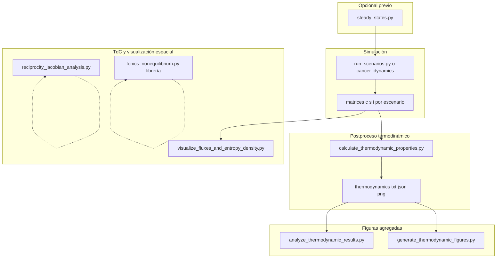

# Pipeline de ejecución, física y matemática (Allee)

Este documento describe **en qué orden** encajan los scripts de análisis y simulación, **qué ejecuta** `calculate_thermodynamic_properties.py --all`, y **qué significa físicamente** cada etapa (sin confundir estado estacionario del modelo con “entropía de equilibrio” clásica).

**Detalle de ecuaciones del PDE, potenciales \(\mu\) y formas de \(\sigma\):** ver [nonequilibrium_termodynamics/MARCO_FISICO_MATEMATICO.md](nonequilibrium_termodynamics/MARCO_FISICO_MATEMATICO.md).

---

## Resumen ejecutivo

- Con **`python termodynamics/calculate_thermodynamic_properties.py --scenarios-file <JSON> --all`**, el programa recorre los escenarios en el **orden en que aparecen** en el array `scenarios` del JSON. Para **cada** nombre imprime `Calculando propiedades termodinámicas para: <escenario>`, procesa **todos** los tiempos con matrices `c,s,i` disponibles, escribe series en `thermodynamics/`, genera resumen y figuras, y **solo entonces** pasa al siguiente escenario.

- **Ningún** script de esta cadena calcula la **entropía termodinámica de equilibrio** \(S\) (como \(k_B \ln \Omega\)) del tejido. Lo que sí hay es: **puntos fijos / bifurcaciones** del modelo reducido (`steady_states`), **trayectorias** del PDE reacción–difusión (`run_scenarios`), y **observables tipo disipación / proxy de producción entrópica** sobre esas trayectorias (`calculate_thermodynamic_properties`, `visualize_fluxes_*`).

---

## Orden de trabajo recomendado

- **Reciprocidad** (`RJ`) puede ejecutarse **con o sin** matrices: solo necesita parámetros del escenario y un punto \((c,s,i)\).
- **`fenics_nonequilibrium`** no tiene CLI; otros scripts o notebooks lo importan si hace falta \(\sigma\) en malla FEniCS.

---

## Tabla por etapa

| Etapa | Script / módulo | Entrada principal | Salida principal | Marco teórico | Objeto / ecuaciones (resumen) | Interpretación física (honesta) |
|-------|-----------------|-------------------|------------------|---------------|--------------------------------|----------------------------------|
| Estados estacionarios (reducido) | `steady_states/steady_states.py` | `scenarios*.json`, modos CLI (`control-3d`, `corner-strong`, …) | Catálogos JSON, figuras de bifurcaciones / regiones según modo | Sistemas dinámicos, análisis de puntos fijos y parámetros (Hill, \(\mu\), …) | Modelo reducido 2D/3D: \(d\mathbf{u}/dt = \mathbf{f}(\mathbf{u},p)\); ceros de \(\mathbf{f}\), estabilidad lineal | “Equilibrio” aquí = **estado estacionario del modelo matemático reducido**, no balance termodinámico completo del continuo 2D ni \(S\) de equilibrio. |
| Simulación espacio–tiempo | `run_scenarios.py` (y/o `cancer_dynamics.py`) | Escenarios, malla FEniCS, `.env` / checkpoints | Por escenario: `matrices/`, `images/`, … | PDE reacción–difusión | \(\partial_t \phi_a = D_a \nabla^2 \phi_a + R_a(c,s,i)\); forma conservativa \(\partial_t \phi_a = -\nabla\cdot\mathbf{J}_a + R_a\), \(\mathbf{J}_a=-D_a\nabla\phi_a\) | Genera **trayectorias fuera de equilibrio** espacialmente extendidas; las reacciones \(R_a\) acoplan y pueden impedir un único potencial escalar global (ver reciprocidad). |
| Postproceso termodinámico | `termodynamics/calculate_thermodynamic_properties.py` | Matrices `c,s,i`, `scenarios_v1.json` (o otro JSON) | `thermodynamics/*.txt`, `thermodynamic_summary.json`, `thermodynamics/images/*` | Funcional efectivo tipo Landau–Ginzburg; analogía TdC isoterma | \(F[c,s,i]\) discretizado; \(\mu_a \sim \delta F/\delta\phi_a\); \(\Sigma_\mu = \int \sum_a D_a\|\nabla\mu_a\|^2\,dA\); \(\Sigma_{\mathrm{diss}} = \int \sum_a D_a\|\nabla\phi_a\|^2\,dA\) (y desgloses por campo) | Cuantifica **gradientes** y **disipación difusiva** sobre la trayectoria guardada; es un **proxy fenomenológico**, no \(\dot{S}\) medido ni contribución reaccional desglosada (ver MARCO §4.2). |
| No reciprocidad (kinetics local) | `nonequilibrium_termodynamics/reciprocity_jacobian_analysis.py` | JSON de escenarios, punto \((c,s,i)\) | Texto o JSON con \(\|N\|_F/\|A\|_F\), etc. | Acoplamiento linealizado de las tasas | \(A_{ab}=\partial R_a/\partial\phi_b\), \(S=(A+A^\top)/2\), \(N=(A-A^\top)/2\) | Mide si el subsistema reaccional **podría** derivar de un único potencial en \((c,s,i)\); relevante para interpretar el \(\mu\) variacional del postproceso termo. |
| Flujos y \(\sigma^+\) espacial | `nonequilibrium_termodynamics/visualize_fluxes_and_entropy_density.py` | Matrices por tiempo, parámetros \(D_a\) | PNG en `nonequilibrium_plots/`, CSV opcional | Fick + disipación por gradientes de concentración | \(\mathbf{J}_a=-D_a\nabla\phi_a\); \(\sigma^+ = \sum_a D_a\|\nabla\phi_a\|^2\) (local) | Visualiza **transporte difusivo** y un **proxy positivo** de mezcla espacial; coherente con término \(\Sigma_{\mathrm{diss}}\) del módulo termo (MARCO §4.1). |
| UFL / FEniCS (densidad \(\sigma\)) | `nonequilibrium_termodynamics/fenics_nonequilibrium.py` | Funciones en malla, `ModelParameters` | (API Python) `Function` / escalares ensamblados | Misma familia que arriba, en formas débiles | \(\sigma_{\mathrm{loc}}\) según convención `field`, `positive_proxy` o `reaction_derivative` | Para integrar o proyectar \(\sigma\) **dentro** de una corrida FEniCS; no sustituye al postproceso sobre matrices guardadas salvo que se use explícitamente. |
| Figuras tipo paper | `termodynamics/generate_thermodynamic_figures.py`, `analyze_thermodynamic_results.py` | Series ya en `.../thermodynamics/` (ruta fija en código: `~/googledrive/.../Resultados Paper`) | Figuras bajo `Paper/` o `Paper copy/figures` | Solo agregación gráfica | Ninguna ecuación nueva | **No** recalculan física; leen `.txt` existentes. Ajustar `BASE_DIR` en el script si los datos están solo en `Allee/results`. |

---

## “Equilibrio” vs “fuera de equilibrio” en este proyecto

| Expresión en el proyecto | Significado |
|--------------------------|-------------|
| Estado estacionario en `steady_states` | Solución de \( \mathbf{f}(\mathbf{u},p) = 0 \) (o análogo) en el modelo **reducido**; útil para clasificar regímenes y control. |
| Trayectoria del PDE | Campos \(c,s,i\) que **cambian en \(t\)** con difusión y reacción: sistema espacial **fuera de equilibrio** en sentido de TdC continua. |
| \(\Sigma_\mu\), \(\Sigma_{\mathrm{diss}}\), \(\sigma^+\) | **Observables construidos** sobre snapshots guardados: miden heterogeneidad espacial y disipación difusiva **asociada al modelo**, no una entropía clausius del organismo. |

Referencias de redacción y contexto: [Biblioteca/markdowns/termodinamica_fuera_equilibrio_allee.md](../Biblioteca/markdowns/termodinamica_fuera_equilibrio_allee.md), [Biblioteca/markdowns/contexto_fisica.md](../Biblioteca/markdowns/contexto_fisica.md).

---

## Comandos rápidos (WSL)

Los one-liners actualizados están en **`Models/notas`** (sección por sección). Este archivo es la **guía conceptual**; las rutas y flags concretas pueden cambiar con el tiempo.

---

*Para ecuaciones completas del continuo, tabla de scripts solo post-simulación y advertencias sobre \(T\) y \(\mu\), ver [MARCO_FISICO_MATEMATICO.md](nonequilibrium_termodynamics/MARCO_FISICO_MATEMATICO.md).*
